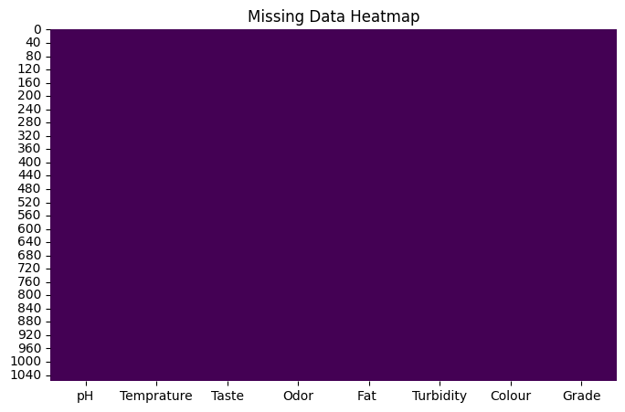

# Milk Quality Prediction Pipeline

This project aims to develop a predictive system that determines the quality of milk based on its physicochemical and sensory properties. By analyzing parameters such as pH, temperature, taste, odor, fat content, turbidity, and color, the study seeks to identify patterns that distinguish between high-quality and low-quality milk samples.

---

## Dataset Source

The pipeline trains and validates models using the public [Kaggle Milk Quality Prediction Dataset](https://www.kaggle.com/datasets/cpluzshrijayan/milkquality) shared by Shrijayan. The dataset includes 1,050 manual observations across 7 distinct physical characteristics to classify final grades.

---

## Project Features

* Data Cleaning: Screens the dataset for invalid inputs and handles extreme outliers in the pH column using the Interquartile Range method.
* Feature Engineering: Creates binary freshness and thickness indicators using raw turbidity and fat values.
* Leakage Prevention: Splits the data into training and validation sets before applying SMOTE oversampling to keep evaluation scores honest and realistic.
* Modeling: Evaluates multiple classification models, selecting a tuned Random Forest classifier as the optimal framework.

---

## Preprocessing and Exploratory Data Analysis

### Missing Data Check
A heatmap validation was performed to confirm data completeness before training. The dataset contained no missing records.



### Outlier Removal
Extreme outliers in the pH distribution were identified and resolved using the Interquartile Range method to protect model stability.


### Class Balancing (SMOTE)
The target variable initially showed an unequal distribution of classes. Synthetic Minority Over-sampling Technique (SMOTE) was applied to ensure equal class representation.


### Feature Selection
A correlation matrix was computed to observe the linear relationships between the engineered physicochemical parameters and the final encoded milk grade.


---

## Technical Stack

* Python 
* Pandas and NumPy
* Scikit-Learn
* Imbalanced-Learn
* Matplotlib and Seaborn

---

## Performance Matrix

We evaluated six supervised frameworks using an 80/20 train-test split configuration. The hyperparameter-tuned Random Forest ensemble delivered optimal classification capacity.

| Supervised Framework | Test Accuracy | Weighted F1-Score | ROC-AUC |
| :--- | :---: | :---: | :---: |
| Random Forest | 0.9719 | 0.9715 | 1.0000 |
| Support Vector Machine | 0.9943 | 0.9900 | 1.0000 |
| K-Nearest Neighbors | 0.9944 | 0.9900 | — |
| Decision Tree | 0.9719 | 0.9700 | — |
| Naive Bayes | 0.9607 | 0.9730 | 0.9843 |
| Logistic Regression | 0.7135 | 0.7901 | 0.7952 |

---

## Setup and Installation

First, clone the repository to your local machine:
```bash
git clone https://github.com
cd milk-quality-prediction
```

Install the necessary dependencies using pip:
```bash
pip install -r requirements.txt
```

---

## Running the Code

To execute the data pipeline, train the models, and view the final test metrics, run the main script:
```bash
python pipeline.py
```

---

## Project Contributors

* J.G.H. Jayalath
* B.M.B.S. Alahakoon
* P.A.S. Dinod
* M.G.M. Sanvidu
* S.A.W. Fernando
* N. Thahani
